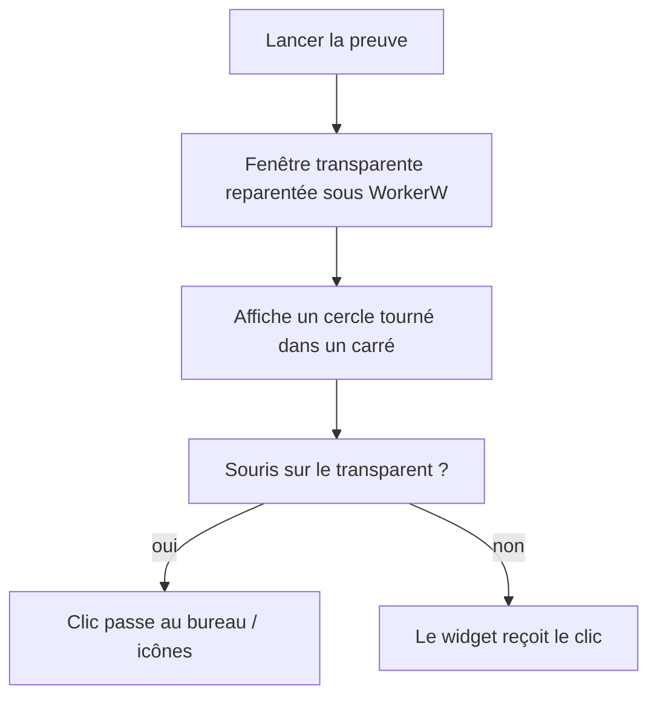

# Instruction: Spike — WorkerW + transparence + click-through

## Architecture projection

> Tree of the final files. ✅ create · ✏️ modify · ❌ delete

```txt
spikes/workerw-proof/            ✅ code jetable, supprimé après validation
├── Cargo.toml                   ✅ deps : windows, png (décodage CapturePreview), + webview2-com si composition
└── src/
    └── main.rs                  ✅ fenêtre transparente + reparenting + hit-test
```

## User Journey



## Wireframe

```txt
          ┌──────────────────────┐
          │  (transparent)       │   ← clic → passe au bureau
          │      ┌─────┐         │
          │      │  ●  │ 45°     │   ← clic → reçu par le widget
          │      └─────┘         │
          │  (transparent)       │
          └──────────────────────┘
```

## Tasks to do

### `1)` Preuve WorkerW + transparence
> Rendre une fenêtre WebView2 transparente visible derrière les icônes.

1. Fenêtre minimale WebView2 (via Tauri ou Win32 direct), `transparent` activé
2. Reparenting sous le WorkerW (`FindWindowEx`, `SendMessage 0x052C`, `SetParent`)
3. Vérifier que le rendu survit au reparenting et que la transparence tient (issue #12450)

### `2)` Click-through sur forme arbitraire tournée
> Laisser passer les clics sur le transparent, pour un cercle tourné dans un carré.

1. Contenu : cercle (HTML/CSS) dans une bounding box, tourné à 45°
2. Capturer l'alpha rendu (`CapturePreview`) → hit-map opaque/transparente
3. `WM_NCHITTEST` : point souris → inverse-rotation → lookup hit-map → `HTTRANSPARENT` ou `HTCLIENT`
4. Tester l'alternative "masque déclaré par le widget" (JS → pont) pour comparer coût/latence

### `3)` Tranchage des options techniques
> Verrouiller mode WebView2 + source de la hit-map.

1. Comparer mode fenêtré vs composition mode (rendu, input, hit-test)
2. Consigner le choix : mode WebView2 + source de hit-map + seuil d'alpha
3. Vérifier l'alignement du hit-test sous scaling DPI ≠ 100 % (125 %/150 %), pixels physiques vs pixels CSS

## Test acceptance criteria

| Task | Acceptance criteria |
| ---- | ------------------- |
| 1 | La fenêtre s'affiche derrière les icônes, au-dessus du wallpaper, sans carré noir ni artefact |
| 2 | Cercle à 45° : les clics sur les coins transparents du carré atteignent le bureau/les icônes ; les clics sur le cercle sont reçus par le widget |
| 3 | Un choix est consigné (mode WebView2 + source de hit-map) avec justification mesurée ; le hit-test reste aligné à 125 %/150 % de scaling |
