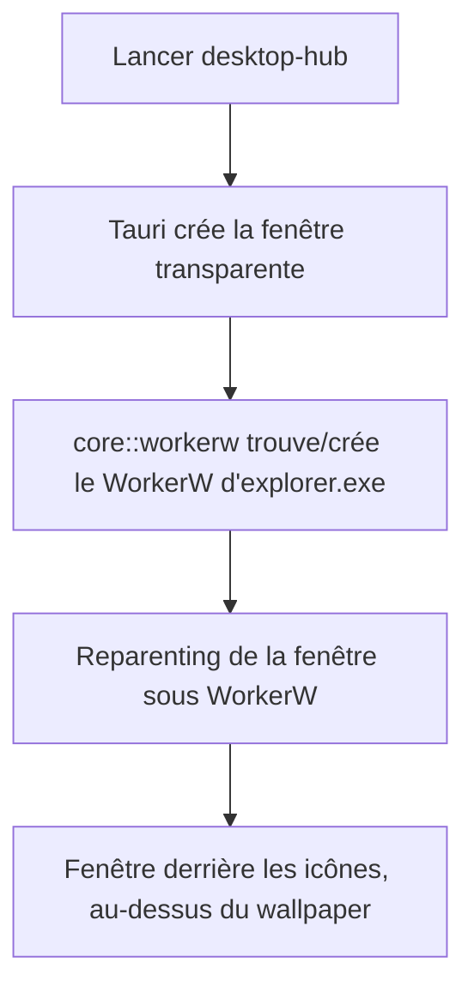

# Instruction: Scaffold Tauri + hack WorkerW

## Architecture projection

> Tree of the final files. ✅ create · ✏️ modify · ❌ delete

```txt
.
├── Cargo.toml                      ✅ workspace racine
├── src-tauri/
│   ├── Cargo.toml                  ✅ deps : tauri 2, windows, serde, serde_json
│   ├── tauri.conf.json             ✅ fenêtre unique transparente, sans décorations, skipTaskbar
│   ├── capabilities/default.json   ✅ permissions minimales (core:window)
│   ├── src/
│   │   ├── main.rs                 ✅ point d'entrée
│   │   ├── lib.rs                  ✅ builder + setup (reparenting)
│   │   └── core/
│   │       ├── mod.rs              ✅ module moteur (démarrage minimal)
│   │       └── workerw.rs          ✅ reparenting sous WorkerW
│   └── src/ui/index.html           ✅ page transparente
```

## User Journey



## Tasks to do

### `1)` Scaffold du projet Tauri v2
> Obtenir une app Tauri minimale qui compile sous Windows.

1. Créer le workspace Cargo + `src-tauri/Cargo.toml` (tauri 2, `windows`, serde)
2. `tauri.conf.json` : fenêtre unique `{ transparent: true, decorations: false, shadow: false, skipTaskbar: true }`
3. `main.rs` + `lib.rs` builder minimal, `index.html` transparente
4. Vérifier le build via `cargo.exe build` invoqué depuis WSL (le dossier `/mnt/c` est visible par Windows) — première commande réelle du repo
5. Frontend 100 % vanilla HTML/CSS/JS : aucun package manager / bundler

### `2)` Module WorkerW
> Flotter la fenêtre au niveau du bureau.

1. `core/workerw.rs` : `FindWindowEx` (Progman → SHELLDLL_DefView → WorkerW)
2. Sinon créer le WorkerW via `SendMessage 0x052C` (WM_SPAWN_WORKERW)
3. Récupérer le HWND Tauri (`Window::hwnd`) et `SetParent` sous le WorkerW
4. Appliquer les réglages validés en phase 0 (transparence qui survit, z-order)
5. **Repli si aucune WorkerW trouvée/créée** (explorer arrêté, desktop slideshow/Spotlight) : fenêtre top-level `always-on-bottom` + log — jamais de crash silencieux

### `3)` Fond transparent webview
> Éviter le fond noir WebView2.

1. Background de la page en transparent (CSS `background: transparent` + `transparent: true`)
2. Vérifier à l'écran l'absence de carré noir

## Test acceptance criteria

| Task | Acceptance criteria |
| ---- | ------------------- |
| 1 | `cargo.exe build` compile depuis WSL ; l'app lance une fenêtre sans bordure sur le Windows host |
| 2 | La fenêtre apparaît derrière les icônes du bureau, au-dessus du fond d'écran ; si le WorkerW est introuvable, repli en top-level `always-on-bottom` + log |
| 3 | Le fond est transparent (pas de carré noir) |
