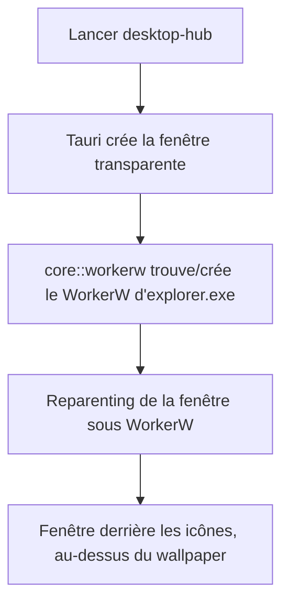

# Instruction: Scaffold Tauri + hack WorkerW

## Architecture projection

> Tree of the final files. ✅ create · ✏️ modify · ❌ delete

```txt
.
├── Cargo.toml                      ✅ workspace racine
├── src-tauri/
│   ├── Cargo.toml                  ✅ deps : tauri 2, windows, serde, serde_json
│   ├── tauri.conf.json             ✅ fenêtre unique transparente, sans décorations, skipTaskbar
│   ├── capabilities/default.json   ✅ permissions minimales (core:window)
│   ├── src/
│   │   ├── main.rs                 ✅ point d'entrée
│   │   ├── lib.rs                  ✅ builder + setup (reparenting)
│   │   └── core/
│   │       ├── mod.rs              ✅ module moteur (démarrage minimal)
│   │       └── workerw.rs          ✅ reparenting sous WorkerW
│   └── src/ui/index.html           ✅ page transparente
```

## User Journey



## Tasks to do

### `1)` Scaffold du projet Tauri v2
> Obtenir une app Tauri minimale qui compile sous Windows.

1. Créer le workspace Cargo + `src-tauri/Cargo.toml` (tauri 2, `windows`, serde)
2. `tauri.conf.json` : fenêtre unique `{ transparent: true, decorations: false, shadow: false, skipTaskbar: true }`
3. `main.rs` + `lib.rs` builder minimal, `index.html` transparente
4. Vérifier le build via le workflow GitHub Actions (runner `windows-latest`, sans SAC) — le build cargo local est bloqué par Smart App Control sur cette machine (vérifié en phase 0) ; l'exe s'exécute ensuite localement
5. Frontend 100 % vanilla HTML/CSS/JS : aucun package manager / bundler

### `2)` Placement bureau : WorkerW ou Progman
> Flotter la fenêtre au niveau du bureau — derrière les icônes, au-dessus du wallpaper.

1. `core/workerw.rs` : trouver `Progman` ; **ne jamais spammer `SendMessage 0x052C`** (ça crée des WorkerW fantômes sur Win11)
2. **Cas standard** : si une fenêtre `WorkerW` contenant `SHELLDLL_DefView` existe → `SetParent` dessous
3. **Cas Win11 courant (icônes sous Progman)** : sinon → `SetParent` sous **Progman** + `SetWindowPos(HWND_BOTTOM)` → la fenêtre passe sous les icônes (elles sont une autre enfant de Progman, au-dessus dans le z-order)
4. **Retirer `WS_EX_TOPMOST`** de la fenêtre avant tout reparenting (sinon elle reste au-dessus des icônes)
5. **Valider le parent choisi** avant `SetParent` (contient la `SHELLDLL_DefView`, ou c'est Progman) : ne jamais parenter vers un WorkerW fantôme → fenêtre clippée invisible
6. Appliquer les réglages validés en phase 0 (transparence qui survit, z-order)
7. Repli ultime si Progman absent : top-level `always-on-bottom` + log — jamais de crash silencieux

### `3)` Fond transparent webview
> Éviter le fond noir WebView2.

1. Background de la page en transparent (CSS `background: transparent` + `transparent: true`)
2. Vérifier à l'écran l'absence de carré noir

## Test acceptance criteria

| Task | Acceptance criteria |
| ---- | ------------------- |
| 1 | Le build compile sur le runner CI (GitHub Actions, sans SAC) ; l'app lance une fenêtre sans bordure sur le Windows host |
| 2 | La fenêtre apparaît **derrière les icônes du bureau**, au-dessus du fond d'écran (WorkerW si dispo, sinon parentée sous Progman + bottom) ; elle n'est **jamais invisible** (parent validé, pas de WorkerW fantôme) ; log des étapes |
| 3 | Le fond est transparent (pas de carré noir) |
