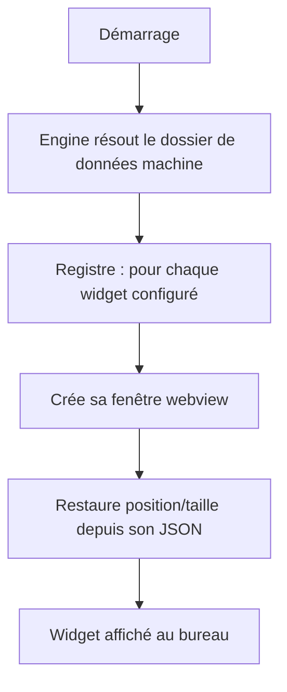

# Instruction: Skeleton moteur + persistance par widget

## Architecture projection

> Tree of the final files. ✅ create · ✏️ modify · ❌ delete

```txt
src-tauri/src/
├── lib.rs                       ✏️ init moteur au setup
├── core/
│   ├── mod.rs                   ✏️ Engine { registry, data_dir }, start/stop
│   ├── registry.rs              ✅ WidgetRegistry : id ↔ WebviewWindow, seed = bundle
│   └── config.rs                ✅ persistance JSON par widget, ancrée moniteur
src/widgets/
└── placeholder/
    ├── widget.json              ✅ manifest (id, entry, skin défaut)
    └── index.html               ✅ cercle dans un carré + coordonnées affichées
```

## User Journey



## Tasks to do

### `1)` Dossier de données par machine
> `%APPDATA%/desktop-hub` = racine des configs/skins/layouts.

1. `core/config.rs` : résolution du data_dir, création si absente
2. Lecture/écriture atomique d'un JSON par widget id (write-then-rename)

### `2)` Registre + cycle fenêtre
> Un widget = une webview isolée. Seed = tous les manifests du bundle.

1. `core/registry.rs` : enregistrer un widget → créer sa fenêtre webview, la fermer/décharger
2. Au démarrage, seed = tous les `widgets/*/widget.json` embarqués (aucune liste globale) ; activation par widget via `enabled` dans son propre JSON machine (défaut : activé)
3. `lib.rs` : au setup, démarrer l'engine avec le widget placeholder

### `3)` Restauration
> Position ancrée à un moniteur, restaurée au boot, sauvegardée à la fermeture.

1. Format de persistance par widget : `{ monitor_index, anchor, offset, size, rotation }` — `anchor` = point de référence sur le moniteur (coin haut-gauche), `offset` = décalage en pixels physiques depuis ce point
2. À l'ouverture : résoudre le moniteur (fallback primaire si `monitor_index` absent/disparu), appliquer l'anchor + l'offset
3. À la fermeture : sauvegarder l'état courant (moniteur actuel + offset)

### `4)` Widget placeholder
> Cercle dans un carré : exerce la forme arbitraire dès maintenant.

1. `widgets/placeholder/widget.json` + `index.html` (cercle + affichage id/taille)

## Test acceptance criteria

| Task | Acceptance criteria |
| ---- | ------------------- |
| 1 | Un fichier JSON par widget apparaît dans le data_dir ; jamais créé s'il n'existe pas de config |
| 2 | Le registre seed ouvre chaque widget du bundle = une fenêtre webview ; un `enabled: false` dans son JSON machine le laisse fermé ; fermer le décharge |
| 3 | Déplacer/redimensionner puis relancer → position/taille restaurées ; un widget positionné sur un moniteur déconnecté revient sur le moniteur primaire |
| 4 | Le placeholder (cercle dans un carré) s'affiche sous le bureau avec ses coordonnées |
