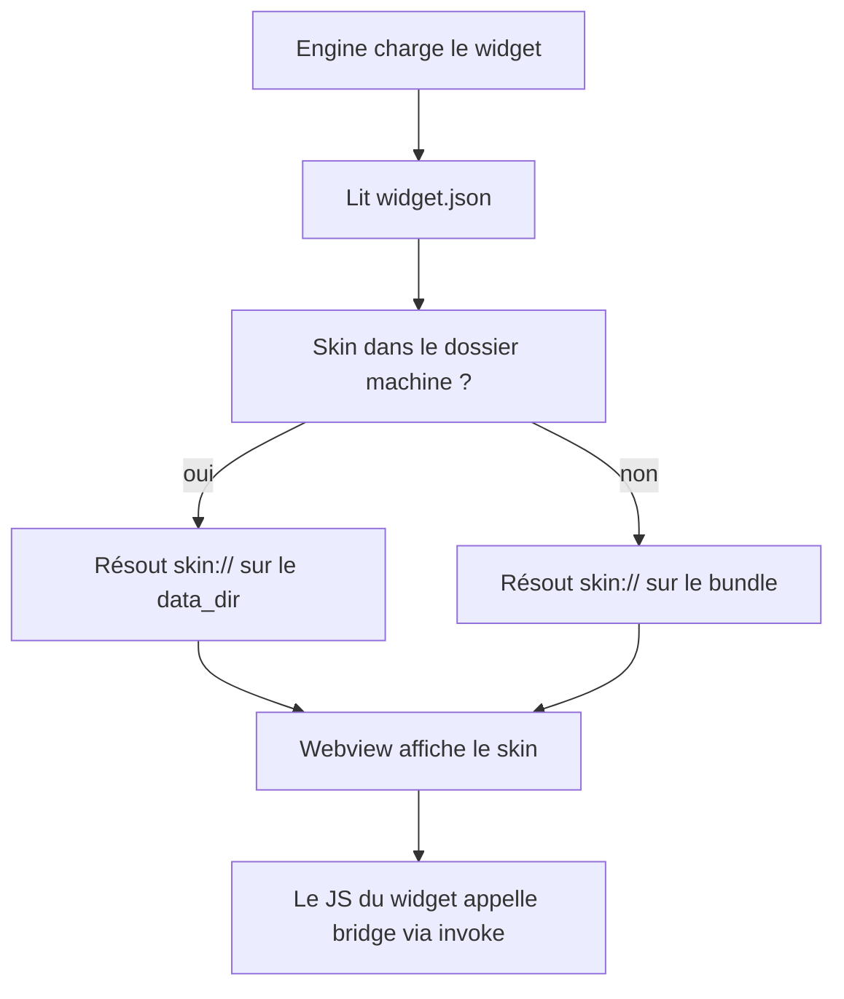

# Instruction: Contrat widget + skins par machine

## Architecture projection

> Tree of the final files. ✅ create · ✏️ modify · ❌ delete

```txt
src-tauri/src/
├── protocol.rs                  ✅ schéma skin:// servant les fichiers de skin
├── lib.rs                       ✏️ enregistrement du protocole + résolveur
├── core/
│   ├── skins.rs                 ✅ résolution : skin défaut packagé > override machine
│   └── config.rs                ✏️ champ skin dans le manifest
src/widgets/placeholder/
├── widget.json                  ✏️ manifest complet (id, entry, skin.default, permissions)
└── skin/                        ✅ skin par défaut packagé
    └── index.html / style.css / main.js
```

## User Journey



## Tasks to do

### `1)` Contrat widget.json
> Contrat stable : id, entry, skin par défaut, permissions. Les permissions déclarées SONT l'octroi.

1. Schéma `widget.json` : `{ id, version, entry, skin.default, permissions[] }`
2. Validation au chargement (rejet + log si invalide)
3. `permissions[]` est l'octroi de base (modifiable à la main dans le data_dir) ; le moteur applique en plus son allow-list en filet de sécurité

### `2)` Protocole skin://
> Servir HTML/CSS/JS des skins depuis le disque, sans exposer le FS au JS.

1. `protocol.rs` : `register_uri_scheme_protocol` `skin://` → résout le chemin (bundle ou data_dir) → sert le fichier avec le bon Content-Type
2. Fichier manquant → 404 + log ; si l'entry elle-même manque, repli sur le skin packagé
3. CSP adaptée (`default-src 'self' skin:` ; pas de connect-src réseau)

### `3)` Résolution de skin par machine
> Un skin déposé dans le data_dir remplace le défaut, sans toucher au code.

1. `core/skins.rs` : défaut du bundle ; si `<data>/skins/<widget-id>/` existe → override
2. La webview charge l'entry via `skin://`
3. Transfert d'un skin entre les deux machines = copie manuelle du dossier `<data>/skins/<widget-id>/` (pas de synchro en v1)

### `4)` Preuve : même widget, deux skins
> La logique ne change pas ; l'apparence peut.

1. Widget placeholder : logique JS (compteur de clics) + skin A packagé + skin B déposé dans le data_dir
2. Retirer le skin B → retour au défaut

## Test acceptance criteria

| Task | Acceptance criteria |
| ---- | ------------------- |
| 1 | Un `widget.json` invalide est rejeté avec un log ; un valide est chargé |
| 2 | La webview charge HTML/CSS/JS via `skin://` ; aucune requête FS directe depuis le JS |
| 3 | Déposer un skin dans le data_dir change l'apparence sans toucher au code ; le retirer ramène le défaut |
| 4 | Le compteur de clics (logique) reste identique entre skin A et skin B |
