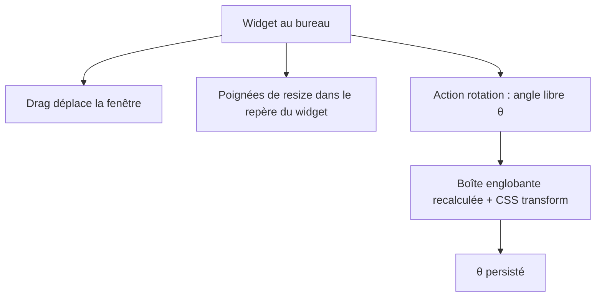

# Instruction: Manipulation — drag, resize, rotation libre

## Architecture projection

> Tree of the final files. ✅ create · ✏️ modify · ❌ delete

```txt
src-tauri/src/
├── core/
│   ├── manipulation.rs          ✅ drag, resize (repère tourné), rotation libre
│   └── config.rs                ✏️ persistance de l'angle θ
src/widgets/placeholder/
└── index.html                   ✏️ transform CSS lu depuis le moteur + overlay debug
```

## User Journey



## Wireframe

```txt
        fenêtre (boîte englobante)
   ┌────────────────────────────┐
   │         (transparent)      │
   │      ┌── resize poignées ──┐
   │      │      ┌─────┐        │
   │      │      │  ●  │ 45°    │   ← contenu tourné (CSS)
   │      │      └─────┘        │
   │      └─────────────────────┘
   └────────────────────────────┘
```

## Tasks to do

### `1)` Drag
> Déplacer le widget sur le bureau.

1. Drag via `data-tauri-drag-region` / `startDragging` depuis la webview
2. Persister la position au relâchement

### `2)` Rotation libre
> Tourner le widget à n'importe quel angle, autour de son centre.

1. **Pivot = centre du widget** (repère local) : la rotation est appliquée autour de l'origine locale
2. Engine expose θ au widget (initialisation / événement) → `transform: rotate(θ)` côté webview
3. Boîte englobante = rectangle englobant de l'empreinte tournée autour du centre, calculée côté Rust
4. Fenêtre redimensionnée à la boîte englobante ; θ persisté
5. Déclencheur pour la phase : geste debug **Ctrl+drag** (le drawer/tray branchera l'UX réelle plus tard)

### `3)` Resize dans le repère tourné
> Les poignées suivent les bords visuels du widget.

1. Poignées alignées sur le repère local tourné
2. Redimensionner selon les axes locaux ; recalculer la boîte englobante ; persister la taille

### `4)` Overlay de debug
> Rendre les critères vérifiables par des chiffres.

1. Overlay affichant θ, taille, boîte englobante dans le placeholder (désactivable)

## Test acceptance criteria

| Task | Acceptance criteria |
| ---- | ------------------- |
| 1 | Le widget se déplace à la souris ; sa position est restaurée après redémarrage |
| 2 | La rotation (Ctrl+drag) s'applique à n'importe quel angle autour du **centre du widget** ; l'empreinte visuelle suit le contenu ; θ restauré |
| 3 | Redimensionner un widget tourné suit ses bords visuels (et non ceux de l'écran) ; la taille est restaurée |
| 4 | L'overlay affiche θ/taille/bbox conformes à la manipulation |
