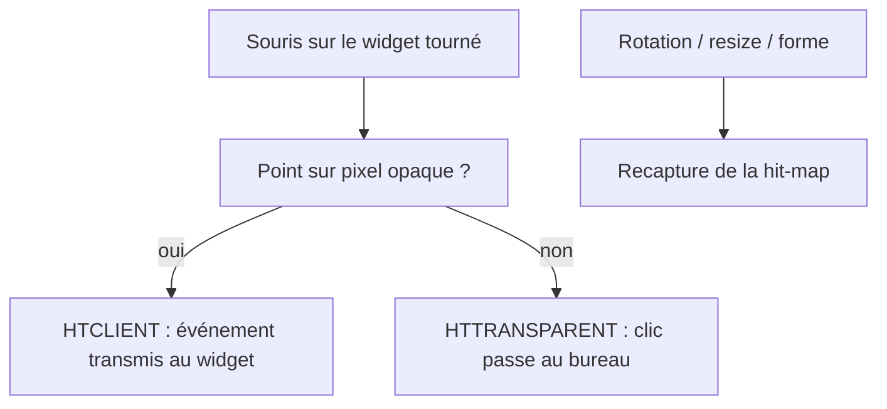

# Instruction: Click-through sur forme arbitraire

## Architecture projection

> Tree of the final files. ✅ create · ✏️ modify · ❌ delete

```txt
src-tauri/src/
├── core/
│   └── hit_test.rs              ✅ hit-map alpha + hit-test par pixel (repère local + inverse-rotation)
├── lib.rs                       ✏️ gestion WM_NCHITTEST (HTTRANSPARENT / HTCLIENT)
src/widgets/placeholder/
└── index.html                   ✏️ cercle dans un carré (forme non-rectangulaire de test)
```

## User Journey



## Tasks to do

### `1)` Hit-map d'alpha
> Masque opaque/transparent dans le repère local du widget, en pixels physiques.

1. `core/hit_test.rs` : capture du rendu (`CapturePreview`) → décodage PNG → masque binaire (seuil d'alpha validé en phase 0)
2. Stockage de la map **en pixels physiques** (résolution du PNG), dans le repère local (non tourné), indexable par pixel

### `2)` Hit-test au pointeur
> Décider clic widget vs clic bureau au niveau fenêtre.

1. Sur `WM_NCHITTEST` : point écran (pixels physiques) → translation vers le client physique → inverse-rotation → lookup dans la map → `HTTRANSPARENT` ou `HTCLIENT`
2. Source de la map (capture moteur ou masque déclaré) = choix verrouillé en phase 0
3. Le scaling DPI ≠ 100 % (125 %/150 %) est géré par cette chaîne de conversion — jamais de mélange CSS/logique pixels

### `3)` Mise à jour
> La map reste exacte après manipulation.

1. Recapture à l'ouverture, à la rotation, au resize, et sur signal du widget (bridge)
2. Vérifier la cohérence avec l'overlay de debug (phase 4)

## Test acceptance criteria

| Task | Acceptance criteria |
| ---- | ------------------- |
| 1 | Cercle tourné dans un carré : les clics sur les coins transparents atteignent le bureau/les icônes |
| 2 | Les clics sur l'empreinte opaque (cercle) fonctionnent normalement |
| 3 | La zone de click-through reste correcte après rotation/resize |
| 4 | Le hit-test reste aligné sur l'empreinte à 125 % et 150 % de scaling Windows |
