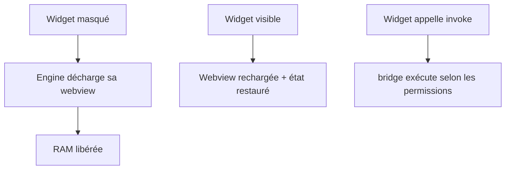

# Instruction: Bridge + cycle de vie

## Architecture projection

> Tree of the final files. ✅ create · ✏️ modify · ❌ delete

```txt
src-tauri/src/
├── bridge/
│   ├── mod.rs                   ✅ commandes invoke : fs.read, drag_drop, app.launch
│   ├── commands.rs              ✅ implémentations
│   └── scopes.rs                ✅ permissions = manifest ∧ allow-list moteur
├── core/
│   ├── lifecycle.rs             ✅ widget.hide/show, crash recovery, mesure RAM
│   └── mod.rs                   ✏️ intégration du cycle de vie
src/widgets/placeholder/
└── main.js                      ✏️ appelle le bridge (lecture fichier, lancement app) + geste hide/show
```

## User Journey



## Tasks to do

### `1)` API bridge
> Commandes invoke : FS limité, drag & drop, lancement d'apps.

1. `bridge/commands.rs` : `fs.read` (dossiers en whitelist), `app.launch`, événements drag & drop
2. `bridge/scopes.rs` : scopes effectifs = `permissions[]` du `widget.json` **∧** allow-list compilée du moteur ; refus + log sinon

### `2)` Cycle de vie
> Décharger un widget caché, mesurer l'empreinte RAM, survivre aux crashes.

1. `core/lifecycle.rs` : API `widget.hide/show(id)` — masquer → détruire sa webview ; réafficher → recharger + restaurer l'état
2. Déclencheur phase : geste debug sur le placeholder (double-clic → hide/show) — pas de tray/UI encore
3. Crash webview : reload automatique une fois + log ; après 3 échecs consécutifs, widget désactivé jusqu'au redémarrage
4. Métrique RAM = **count des process renderer WebView2** + private working set, à vide vs avec widgets chargés

## Test acceptance criteria

| Task | Acceptance criteria |
| ---- | ------------------- |
| 1 | `invoke(fs.read, chemin autorisé)` fonctionne ; un chemin hors scope est refusé (log) ; une permission non couverte par l'allow-list moteur est refusée même si déclarée |
| 2 | Masquer un widget → le count de process renderer WebView2 diminue d'au moins 1 ; le réafficher le recharge à sa place |
| 3 | Une app configurée se lance via le bridge |
| 4 | Un webview crashé est rechargé une fois ; N échecs consécutifs désactivent le widget (log) |
